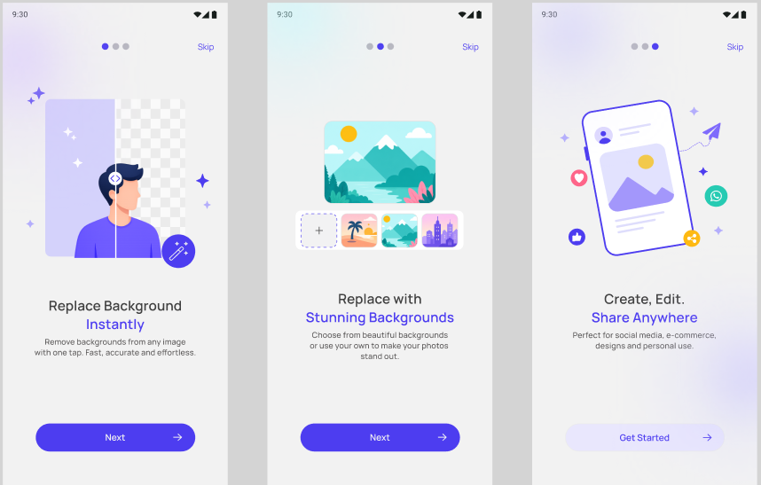
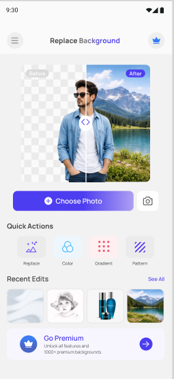
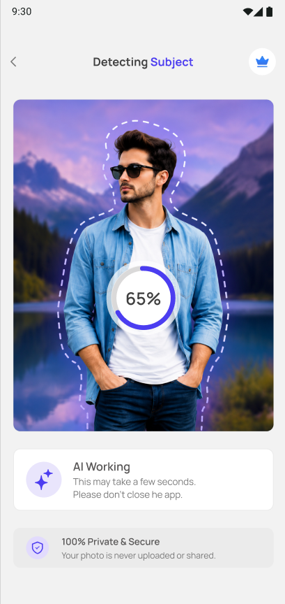
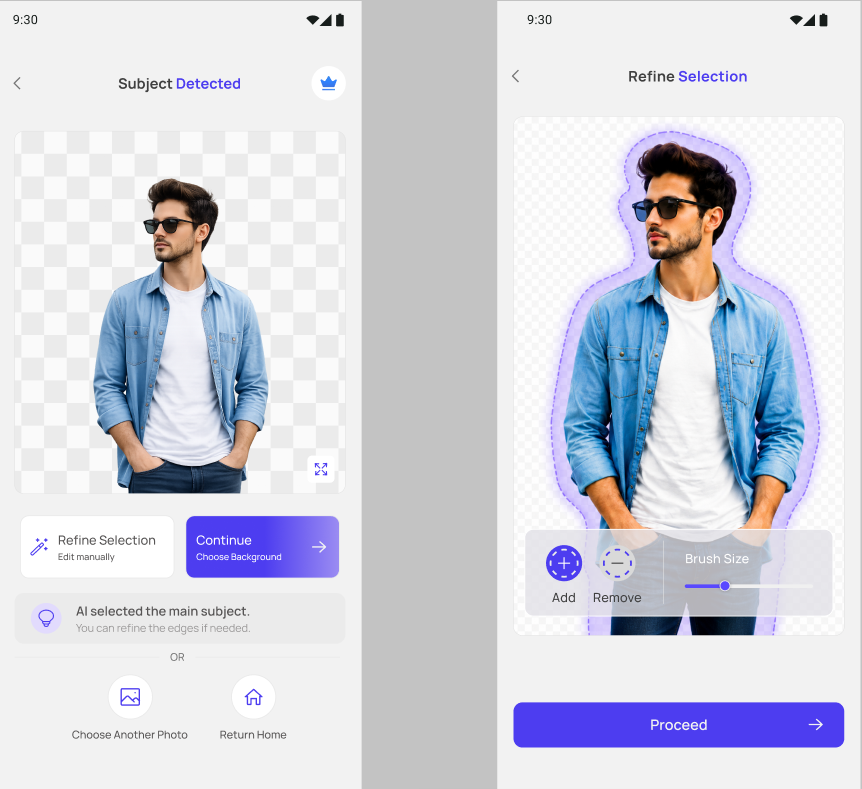
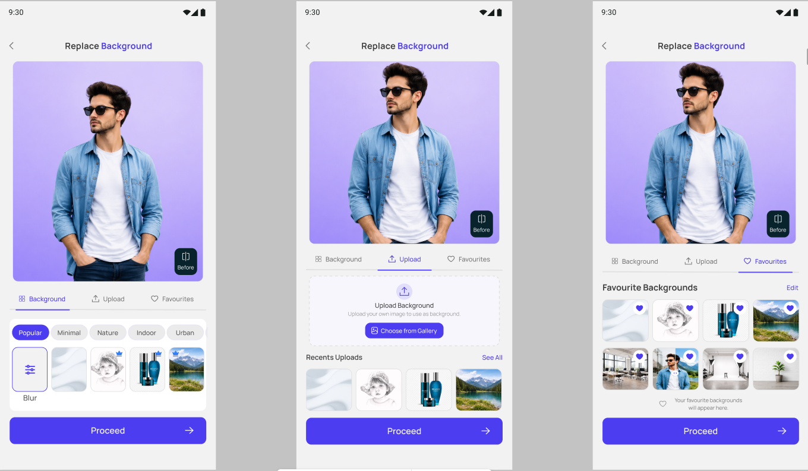
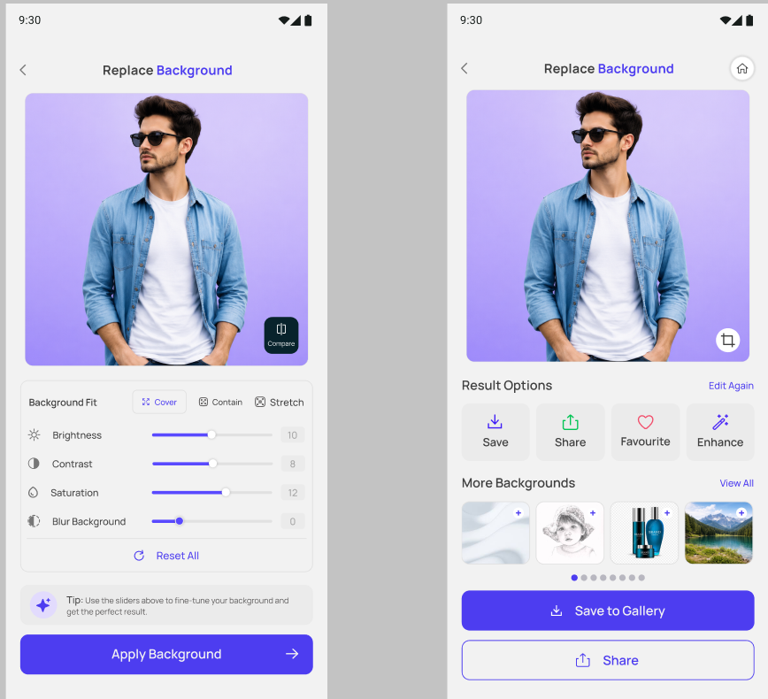
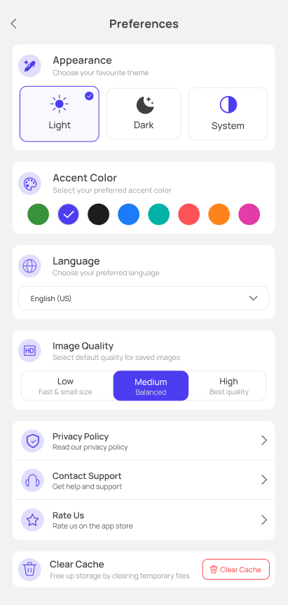
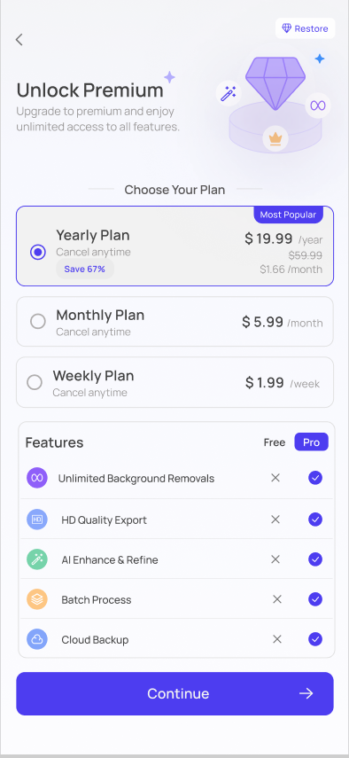

# Replace Background 🪄

> **Note:** This is a showcase repo. The app was built for a client at WebsCare, so the source code is private — this repo documents the project, my role, and how it works.

An AI-powered photo editing app that removes and replaces backgrounds in one tap — using on-device subject detection, a curated background library, and fine-grained manual editing tools.

## The Problem It Solves
Background removal tools are often either too basic (one-tap, no control) or too complex (full photo editors). Replace Background sits in between: fast AI-driven subject detection with a simple guided flow, but with manual refinement, background categories, and image adjustment tools for users who want more control — all without needing design software.

## Features

**Core Flow**
- Guided onboarding introducing the core value: instant background removal, stunning background replacement, and easy sharing
- Choose a photo from gallery or camera
- On-device AI subject detection with a live progress indicator
- Manual refine-selection tool (add/remove brush) for correcting AI edge detection

**Background Replacement**
- Curated background categories (Popular, Minimal, Nature, Indoor, Urban) plus blur
- Upload a custom background from gallery
- Favourite backgrounds for reuse
- Before/after comparison toggle

**Editing**
- Background fit controls: Cover, Contain, Stretch
- Brightness, contrast, saturation, and background blur sliders
- Save, share, favourite, or further "Enhance" the result
- Save to gallery in selectable export quality (Low/Medium/High)

**App-wide**
- Light/Dark/System theme, selectable accent color
- Recent edits and edit history
- Premium tier: unlimited background removals, HD export, AI enhance & refine, batch processing, cloud backup (Yearly/Monthly/Weekly plans)

## Tech Stack
| Category | Technology |
|---|---|
| Language | Kotlin |
| Image Sourcing | Unsplash API |
| Subject Detection | On-device subject segmentation model |
| IDE | Android Studio |

## My Role
Owned the complete build solo at WebsCare — UI across the full flow (onboarding, home, detection, editing, results, preferences, premium paywall), Unsplash API integration for background sourcing, the subject-segmentation image-processing pipeline, and manual testing.

## Screenshots

**Onboarding & Home**
| Onboarding | Home |
|---|---|
|  |  |

**AI Detection & Refinement**
| AI Detecting Subject | Refine Selection |
|---|---|
|  |  |

**Background Selection & Editing**
| Choose Background (Popular / Upload / Favourites) | Edit Tools & Result |
|---|---|
|  |  |

**Settings & Premium**
| Preferences | Premium Paywall |
|---|---|
|  |  |

## What I Learned Building This
- Integrating an on-device subject-segmentation model into a real-time camera/gallery workflow
- Building a manual refinement layer (brush-based add/remove) on top of an AI-generated selection
- Designing a multi-step editing flow (detect → refine → replace → adjust → export) that stays intuitive
- Structuring a premium/paywall tier with multiple pricing plans and feature gating
- Integrating the Unsplash API for a searchable, categorized background library
